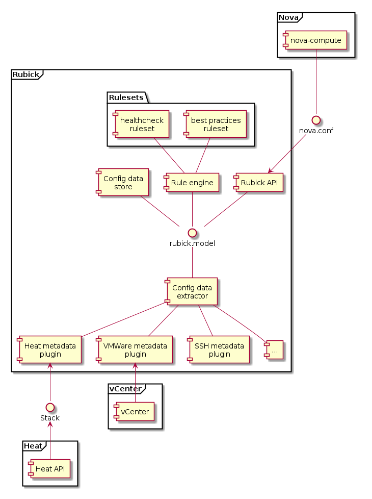

Integration with OpenStack
==========================

Use Case #1. Validate initial configuration
-------------------------------------------

OpenStack Diagnostics could add value to OpenStack Deployment by providing
on-demand or automated verification of OpenStack configuration created by user
of Deployment tools.

OpenStack Deployment (TripleO) allows user to manage OpenStack cloud (called
'overcloud' in terms of TripleO) as standard OpenStack environment. This
involves Heat, Nova with baremetal driver (or Ironic service) and Tuskar as a
user interface application, all installed in small 'management' environment
called 'undercloud'. 

When user wants to install 'overcloud', he uses Tuskar UI to configure bare
metal in cluster and set roles for all nodes. Tuskar then creates Heat
Orcestration Template (HOT) which describes overcloud architecture. This
template also contains node-specific configurations of overcloud OpenStack
components as nodes metadata. This template could be used by Diagnostics as a
source of information for analysis.

Currently (as of Havana release) there is no support for automated creation of
images for overcloud nodes in TripleO. However, once such functionality added to
the project, Diagnostics could fetch base configuration templates for all
overcloud components. Until then, user will have to provide these templates to
Diagnostics service via API.

Combining node-specific metadata with configuration templates, Diagnostics will
have comprehensive configuration information for the new 'overcloud' and will be
able to match it to ruleset to verify configuration consistency.

The following diagram illustrates architecture of the described case:

.. image:: images/openstack_integration_tripleo_arch.png

The following sequence diagram shows data exchange in dynamic:

.. image:: images/openstack_integration_tripleo_seq.png

This diagram shows integration points between OpenStack TripleO (OpenStack on
OpenStack) program and the diagnostics system. Diagnostic system will perform
the following steps:

* extract initial environment configuration from **metadata services**
  of the 'undercloud' (in terms of TripleO). Heat Orchestration Templates for
  OpenStack 'overcloud' describe nodes and their roles, as well as configuration
  parameters. 
* populate an **architecture data model** with actual configuration
  parameters from metadata services.
* run **inspections** through the architecture data model by
  set of **production rules** defined by user, or selected by user from the list
  of all available rules, defined externally.
* report **results of inspection** as a list of rules that were checked with
  indication of matched and unmatched rules. For unmatched rules, diagnostics
  could give **recommendations and hints**.

Use Case #2. Validate startup conifguration of service
------------------------------------------------------

This use case is connected to blueprint drafted by Nova VMWare driver team: 
https://blueprints.launchpad.net/nova/+spec/config-validation-script

  Create a configuration check framework which will check the core service
  endpoints as well as the hypervisor configuration. This script can be used
  before starting openstack to verify that the configuration is correct.
  Initially this will be a nova config check but could be used for other
  services as well.

  Specific to the VC driver - It would also be nice if (perhaps a different
  scipt) could connect to a given VC and extract the proper configuration for
  that VC - i.e. the cluster, datastore regex etc

This use case will require implementation of additional collector plugins:

* **vCenter collector** capable of collecting vCenter server configuration.
* **service collector** is a library which might be called at the time of
  service initialization and talk to Rubick to validate configuration params of
  the service against the set of services Rubick already aware of.

Use Case #2 requirements summary
++++++++++++++++++++++++++++++++

This section is a summary of requirements to common configuration validation
framework raised in ML discussion of the topic and in IRC discussions with
VMWare subteam.

1. (ndipanov) Integrate with existing validation hook in the service class
http://git.openstack.org/cgit/openstack/nova/tree/nova/service.py#n283
1. (jgarbutt) Minimize performance effect on CI gate tests
1. (ndipanov) Consider upgrade implications
1. (gkotton) Stand-alone tool which will also work across services
1. (gkotton) Discover components to validate configurations for (e.g. if Neutron
   is configured, then check Neutron credentials are correct)
1. (tjones) Stand-alone tool which will be run after initial deployment
1. (tjones) Track validated configurations and only revalidate if needed
1. (rbryant) Run validation during service startup unless that affects
   performance
1. (jgordon) catch following error types: a) duplicate/nonexistant options; b)
   invalid mix of settings
1. (jgordon) generic standalone tool for case a) is in nova/tools:
https://git.openstack.org/cgit/openstack/nova/tree/tools/config/analyze_opts.py
1. (markmc) encode validation options in config option declaration
1. (jgarbutt) +1 to jgordon, a) encoded in flag definitions b) standalone tools
1. (hartsock) library to be reused between standalone tool and service init-hook
1. (dhellman) coordinate with
https://etherpad.openstack.org/p/icehouse-oslo-config-import-side-effects
1. (dhellman) integrate with existing sample file generator
1. (lorin) integrate with generate documentation from config files and transform
   constraints into human-readable version

As a part of this use case, we plan to contribute the extended typization of
configuration parameters and corresponding validations to oslo.config library.

Use Case #3. Diagnostic API to get 'state of world' for OpenStack
-----------------------------------------------------------------

Introduced by OpenStack infra team as a part of initiative to improve
debuggability go the OpenStack CI gating process, this case involves creating
API which could be used to get 'state of world' for OpenStack services. This
state inlcudes hardware- and system-level configuration parameters of the
platform and has huge overlap with Rubick's vision of architecture/configration
data model.
It could be implemented by exposing the data model via REST API. Configuration
collection must be made possible upon request, using collection agents.
